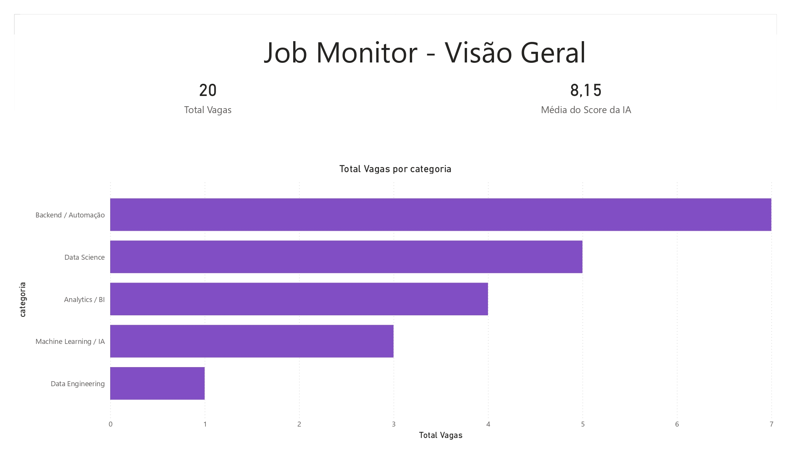
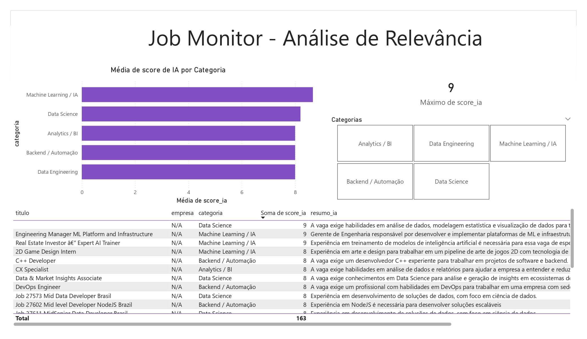
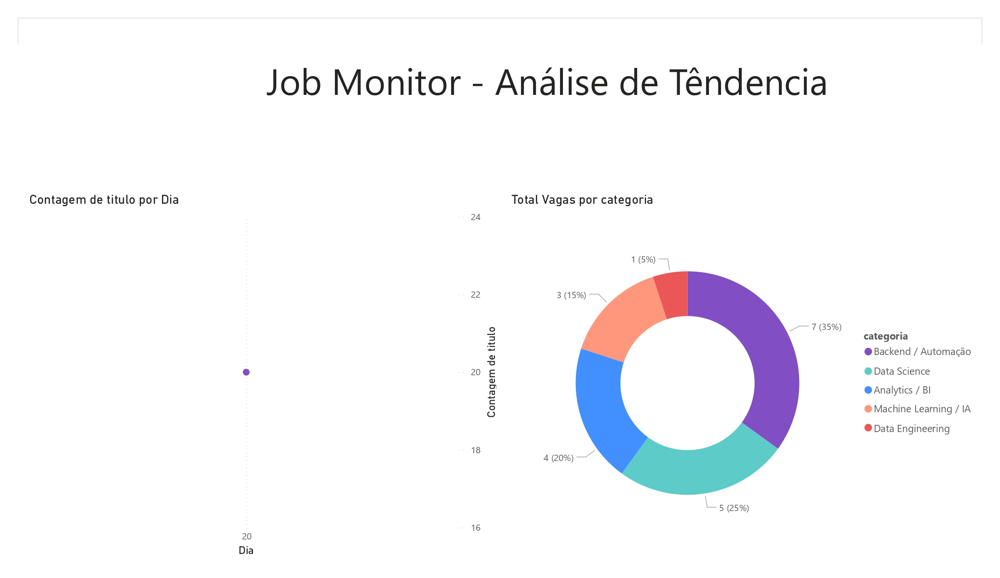

# 🔍 Job Monitor — Painel de Monitoramento de Vagas em Data Science

Projeto de coleta, categorização e análise automatizada de vagas de emprego em Data Science, usando Python, Web Scraping, SQL, IA e Power BI.

---

## 📸 Dashboard

### Visão Geral


### Análise de Relevância


### Análise de Tendência


---

## 🚀 Tecnologias utilizadas

| Tecnologia | Uso no projeto |
|---|---|
| Python | Orquestração e análise de dados |
| Requests + BeautifulSoup | Web Scraping de feeds RSS públicos |
| SQLite + SQL | Armazenamento e modelagem relacional de dados |
| Groq API (LLaMA 3.1) | Categorização e scoring de vagas com AI Prompting |
| pandas | Manipulação, limpeza e transformação dos dados |
| matplotlib / seaborn | Visualizações e gráficos exploratórios |
| Git / GitHub | Versionamento do projeto |
| Power BI | Dashboard executivo com análise de relevância |

---

## 📁 Estrutura do projeto

```
job-monitor/
├── scripts/
│   ├── scraper.py            # Coleta de vagas via RSS (Requests + BeautifulSoup)
│   ├── database.py           # Modelagem e operações no banco SQLite
│   ├── ai_categorizer.py     # Integração com Groq API (AI Prompting)
│   └── pipeline.py           # Orquestrador do fluxo completo
├── images/                   # Screenshots do dashboard
├── data/                     # Banco SQLite gerado após execução
├── outputs/                  # CSV exportado para o Power BI
├── requirements.txt
└── README.md
```

---

## ⚙️ Como rodar

### 1. Clone o repositório
```bash
git clone https://github.com/mathmoraesdev/Job-Monitor-Painel-de-Monitoramento-de-Vagas-em-Data-Science.git
cd Job-Monitor-Painel-de-Monitoramento-de-Vagas-em-Data-Science
```

### 2. Crie e ative o ambiente virtual
```bash
python -m venv .venv

# Windows
.venv\Scripts\activate

# Linux/Mac
source .venv/bin/activate
```

### 3. Instale as dependências
```bash
pip install -r requirements.txt
```

### 4. Configure as variáveis de ambiente
Crie um arquivo `.env` na raiz do projeto:
```
GROQ_API_KEY=sua_chave_aqui
```
Obtenha sua chave gratuita em: https://console.groq.com

### 5. Execute o pipeline
```bash
cd scripts
python pipeline.py
```

O CSV com as vagas processadas será gerado em `outputs/vagas_processadas.csv`.

---

## 📊 Fluxo do pipeline

```
RSS Feeds → BeautifulSoup → DataFrame → SQLite → Groq API → CSV → Power BI
```

1. **Scraping** — coleta vagas de feeds RSS públicos (RemoteOK, WeWorkRemotely)
2. **Banco de dados** — salva com schema relacional, evitando duplicatas
3. **IA** — categoriza cada vaga e atribui score de relevância via LLaMA 3.1
4. **Exportação** — gera CSV para análise no Power BI

---

## 🔒 Segurança

O arquivo `.env` está no `.gitignore` e nunca é enviado ao repositório. Nunca compartilhe sua chave da API publicamente.

---

**Autor:** Matheus Moraes  
**Contato:** math.moraes.dev@gmail.com  
**LinkedIn:** linkedin.com/in/matheus-moraes-dev-
